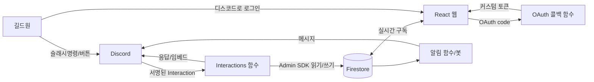

# 한길련 디스코드봇 프로젝트 — 구체 설계도

> 목표: **디스코드 안에서** 계정 생성 · 캐릭터 등록 · 신청/수정/취소/전환 · 조회/검색 · 알림까지 전부 해결.
> 웹을 귀찮아하는 사람도 디스코드만으로 완결. 웹과 **실시간 양방향** 동기화. 신원은 **디스코드 로그인(OAuth) 메인 + 기존 닉네임/PIN 예비**.

---

## 0. 핵심 원칙

1. **단일 진실원천 = Firestore.** 웹과 봇은 같은 DB를 읽고 쓴다. 웹은 이미 실시간 구독 중이라, 봇이 쓰면 웹에 즉시 반영된다.
2. **봇은 슬래시 명령 + 버튼 + 선택메뉴 + 모달**로 동작한다. (웹훅은 보내기 전용이라 입력을 못 받음 → 봇 필요)
3. **봇의 수신 두뇌 = Firebase HTTPS 함수**(Interactions 엔드포인트). 24시간 켜두는 별도 서버 불필요.
4. **봇은 Admin SDK로 DB에 쓴다 → 보안규칙을 우회.** 따라서 인가(누가 뭘 할 수 있나) 로직을 봇 안에 **다시 구현**해야 한다.
5. **기존 닉/PIN 로그인은 없애지 않는다.** OAuth를 메인으로 올리되 예비 경로로 유지 → 마이그레이션 리스크↓, 엣지 케이스 보호.

---

## 1. 전체 아키텍처

| 구성요소 | 역할 | 신규/기존 |
|---|---|---|
| React 웹 (GitHub Pages) | 기존 화면 + "디스코드로 로그인" 버튼 추가 | 기존+일부수정 |
| Firestore | 단일 DB (users/raids/apps/guilds/logs…) | 기존 |
| Cloud Functions (알림) | 현 웹훅 알림 | 기존(이전/유지) |
| **Discord App(봇)** | 슬래시명령·버튼·모달 | **신규** |
| **Interactions 엔드포인트** (HTTPS 함수) | 디스코드 클릭 수신·서명검증·DB 읽고쓰기·응답 | **신규** |
| **OAuth 콜백 함수** (HTTPS 함수) | 디스코드 OAuth code → Firebase 커스텀 토큰 | **신규** |

**데이터 흐름(양방향)**
- 디스코드에서 신청 → 함수가 `apps` 문서 작성 → 웹 화면 즉시 갱신.
- 웹에서 신청 → 알림 함수가 디스코드 메시지 발송/갱신.

---

## 2. 인증 · 신원 설계

### 2-1. 두 경로 공존
- **메인: 디스코드로 로그인(OAuth2).** 웹 "디스코드로 로그인" 버튼 → 디스코드 승인 → OAuth 콜백 함수가 **Firebase 커스텀 토큰** 발급 → 웹 로그인. (디스코드는 Firebase 기본 제공자가 아니라 커스텀 토큰 방식이 표준)
- **예비: 기존 닉네임 + PIN.** 그대로 유지.

### 2-2. 디스코드 ↔ 웹 계정 매핑
- 신규 컬렉션 `discordLinks/{discordUserId} = { userId, linkedAt }`
- `users/{userId}`에 `discordId` 필드 추가(역방향 조회용).
- 봇은 모든 명령에서 `discordLinks`로 신원 확인. 매핑 없으면 "먼저 연동/가입하세요" 안내.

### 2-3. 연동을 만드는 두 방법(시기별)
- **초기(웹 OAuth 전):** 원타임 코드 — 웹 로그인 상태에서 코드 발급 → 디스코드 `/연동 123456`.
- **웹 OAuth 도입 후:** "디스코드로 로그인" 한 번이면 매핑 자동 생성(코드 불필요).

### 2-4. 기존 회원 마이그레이션 순서(안전 우선)
1. OAuth/매핑 인프라 배포(단, 기존 로그인 그대로 동작).
2. 로그인된 기존 회원에게 "내 디스코드 연결" 버튼 노출 → 1회 클릭으로 `discordId` 연결.
3. 신규 회원은 처음부터 디스코드 로그인 가능.
4. 닉/PIN은 계속 예비로 유지(강제 폐기 안 함).

---

## 3. 데이터 모델 변경 / 추가

**신규**
- `discordLinks/{discordUserId}` = `{ userId, linkedAt }`
- `linkCodes/{code}` = `{ userId, expiresAt }`  (원타임 코드용, 단기 만료)
- (선택) `discordMessages/{raidId}` = `{ announceMessageId, channelId }`  ← 웹 변경 시 디스코드 메시지를 "그 자리에서" 갱신하려면 필요

**변경**
- `users/{userId}`: `+ discordId`
- `raids/{raidId}`: `+ allowExternal: boolean`(기본 false) — "외부 길드원 참가 허용". 검색/신청 필터의 판단 근거. **웹 레이드 생성 폼에 체크박스 추가 필요.**

**기존(그대로 사용)**
- `users.characters[]`(name, server, classId, specs[], …), `mainCharIndex`
- `raids/{id}/apps/{userId}`(charName, server, className, classColor, specName, allSpecNames, role, ilvl, swap, swapRoles, status[active/wait/bench], seq, isReservation …)
- `raids/{id}/logs`, `gamedata/{classes,…}`, `guilds`

---

## 4. 슬래시 명령어 목록

> 디스코드는 한글 명령어를 허용한다(`/신청` 가능). 영문 병기도 가능.

| 명령어 | 용도 | 권한 |
|---|---|---|
| `/가입` | 계정 생성(닉네임·길드·첫 캐릭터) | 누구나 |
| `/연동` | 기존 웹계정과 디스코드 연결(코드) | 누구나 |
| `/캐릭터등록` | 캐릭터 풀등록(마법사) | 연동됨 |
| `/캐릭터수정` | 캐릭터 정보 수정 | 연동됨 |
| `/아이템레벨` | 아이템레벨만 빠르게 수정 | 연동됨 |
| `/파티검색` | 날짜로 참가 가능한 레이드 조회(필터) | 연동됨 |
| `/신청` | 레이드 신청 | 연동됨 |
| `/내신청` | 내 신청 현황 조회/수정/취소 | 연동됨 |
| `/관리` | 대기↔확정↔벤치 전환 등 | 공대장/관리자 |

---

## 5. 주요 흐름 상세

### 5-1. `/가입`
버튼 → 모달(닉네임, PIN[선택]) → 길드 선택(드롭다운) → 첫 캐릭터는 5-2 마법사로 연결. 함수가 `users` + `nicknames` + `discordLinks` + (Admin SDK) Firebase Auth 계정 생성.
- 디스코드만 쓸 사람은 **PIN 생략 가능**(웹 로그인은 나중에 OAuth로).

### 5-2. `/캐릭터등록` — 다단계 마법사 + 경고문
1. **경고/선택 단계:** "웹에서 하면 훨씬 빠릅니다. 그래도 디스코드로 진행할까요?" + 버튼 `[웹에서 하기]` `[디스코드로 계속]`.
   - `[웹에서 하기]` → (OAuth 도입 후) 이미 로그인된 캐릭터 등록 페이지로 딥링크.
   - "다음부턴 바로 진행" 옵션으로 반복 노출 방지.
2. **클래스 선택**(드롭다운, 13종)
3. **특성 선택**(클래스에 따라 동적 드롭다운, ≤4)
4. **스왑 가능 역할**(다른 역할 특성이 있으면 토글/선택) → `swap`, `swapRoles`
5. **아이템레벨 + 캐릭터명/서버**(모달, 텍스트 입력)
6. **확인**(요약 임베드 + `[저장]`) → `users.characters[]`에 추가.

> Discord 제약 반영: 드롭다운과 숫자입력을 한 화면에 못 섞으므로 단계 분리. 모달엔 텍스트만.

### 5-3. `/캐릭터수정` / `/아이템레벨`
- `/캐릭터수정`: 캐릭터 선택 → 바꿀 항목만 다시 단계 진행(경고문 없음).
- `/아이템레벨`: 캐릭터 선택 → **모달 한 방**으로 숫자만 갱신(가장 잦은 작업, 최소 마찰).

### 5-4. `/파티검색` (날짜 + 길드 필터)
1. "몇 월 며칠?" 날짜 선택(드롭다운/모달).
2. 함수가 그 날짜 레이드 조회 후 **보는 사람 기준 필터**:
   - 연합 레이드(`partyType==='union'`) → 항상
   - 본인 소속 길드 레이드 → 표시
   - 다른 길드 레이드 → `allowExternal === true`인 것만
3. 결과를 임베드 목록 + 각 항목에 `[신청]` `[상세]` 버튼.
> 이 판정은 **웹의 신청 가능 규칙과 동일 로직**을 공유(일관성).

### 5-5. `/신청`
레이드 선택 → 내 캐릭터 선택(저장된 것) → (스왑/예비 옵션) → `[신청]`. 함수가 `apps/{userId}` 작성(role·spec·ilvl·swap 등 캐릭터에서 끌어옴). 웹 즉시 반영 + 알림 발송.

### 5-6. `/내신청` (수정/취소)
내 신청 목록 임베드 → 각 항목 `[수정]` `[취소]`. 취소=문서 삭제. 수정=특성/아이템레벨/스왑 변경.

### 5-7. `/관리` (전환)
공대장/관리자만. 레이드 선택 → 인원 목록 → 각자 `[확정]` `[대기]` `[벤치]` 버튼으로 `status` 변경. (대기↔확정↔벤치 모든 전환)

### 5-8. 조회 결과/내신청은 기본 **본인에게만 보이게(ephemeral)** 처리(채널 도배 방지).

---

## 6. 알림 설계
- 현 알림(새 레이드/신청/취소/전환/마감/미마감 리마인드)은 **봇으로 흡수하거나 기존 함수 유지** 둘 다 가능.
- 추천: 기존 알림 함수 유지(이미 동작) + 봇은 입력 처리 담당. 추후 "메시지 그 자리 갱신"이 필요하면 `discordMessages`에 메시지ID 저장해 편집.
- (이미 반영됨) 알림은 **연합 레이드만**. 길드별 채널 알림은 향후 `partyType`별 웹훅 분기로 확장.

---

## 7. 권한 / 인가 (봇에서 재구현)
봇은 규칙을 우회하므로 함수 안에서 **반드시** 검사:
- 행위자 신원 = `discordLinks` 매핑 필수.
- 신청 가능 여부 = 길드/외부허용/마감 규칙(웹과 동일).
- 전환/관리 = `role`(admin/super) 또는 해당 레이드 공대장만.
- 남의 신청 수정/취소 차단(본인 또는 관리자만).

---

## 8. 디스코드 기술 제약 & 대응
- **3초 응답 / 15분 후속**: 모든 상호작용 즉시 ack, 무거운 처리는 "처리 중…" 지연응답(defer) 후 편집.
- **콜드 스타트**: 지연응답으로 흡수. 필요 시 min-instances(소액 비용).
- **모달 제약**: 텍스트 입력만, 모달→모달 불가 → 마법사 단계 설계로 우회.
- **드롭다운 25개 한도**: 레이드 25개 초과 시 페이지네이션.
- **단일 서버 사용**: 디스코드 앱 심사 불필요(100서버↑/특수 인텐트만 심사).

---

## 9. 보안
- Interaction **Ed25519 서명검증** 필수(미구현 시 디스코드가 엔드포인트 등록 거부).
- 비밀값(봇 토큰, 클라이언트 시크릿, OAuth 시크릿)은 함수 Secret으로 관리.
- PIN을 디스코드 모달로 받는 경우 로그 금지·즉시 해시 처리. (가능하면 PIN 생략/웹 OAuth로 유도)
- Admin SDK 쓰기 전 인가 검사 누락 금지.

---

## 10. 단계별 구현 로드맵 (MVP → 확장)

**Phase 0 — 뼈대 (가장 안전, 빠른 가치)**
디스코드 앱 등록 · Interactions 함수 + 서명검증 · `/연동`(코드) · **읽기 전용** `/파티검색`, `/내신청`. 쓰기 없음 → 위험 0.

**Phase 1 — 쓰기 시작**
`/신청`, `/내신청`의 취소. 인가 로직 재구현. (가장 가치 큰 핵심)

**Phase 2 — 캐릭터**
`/캐릭터등록`(마법사+경고문), `/캐릭터수정`, `/아이템레벨`, `/가입`.

**Phase 3 — 전환·필터**
`/관리`(대기/벤치 전환) + `raids.allowExternal` 플래그(웹 폼 추가) + 검색 필터 완성.

**Phase 4 — 웹 OAuth**
"디스코드로 로그인" + 커스텀 토큰 함수 + "웹에서 하기" 딥링크 + 기존 회원 디스코드 연결 UI.

**Phase 5 — 다듬기**
메시지 그 자리 갱신(`discordMessages`), 길드별 채널 알림 분기, ephemeral/페이지네이션 등.

> 순서 근거: **읽기→쓰기→설정→인증** 순으로 위험을 뒤로 미룬다. 인증(OAuth)은 깨지면 치명적이라 충분히 검증된 뒤 마지막에.

---

## 11. 열린 결정사항 / 리스크
1. **PIN 정책**: 디스코드 전용 사용자는 PIN 없이 갈지(웹은 OAuth로만). → 권장: 선택.
2. **`allowExternal` 기본값/노출 범위**: 외부 허용 시 "어느 길드까지" 보일지(전체 공개 vs 특정).
3. **공대장 판정 기준**: `raid.leader` 문자열 vs 별도 leader userId 필드. 현재 leader가 이름 문자열이면 **leader를 userId로 잇는 보강** 필요할 수 있음.
4. **캐릭터의 ilvl 저장 위치**: 캐릭터 단위 저장 vs 신청 시 입력. 봇에선 캐릭터에 저장해두고 끌어오는 게 편함 → 데이터 정리 필요.
5. **알림 이전 여부**: 기존 함수 유지 vs 봇 일원화.

---

### 다음 액션
이 설계도에서 **Phase 0~1(연동 + 조회 + 신청/취소)** 부터 착수하는 것을 추천합니다 — 위험이 가장 낮고 체감 가치가 가장 큽니다. 시작 신호 주시면 디스코드 앱 등록 절차와 Interactions 함수 뼈대부터 구체화하겠습니다.
